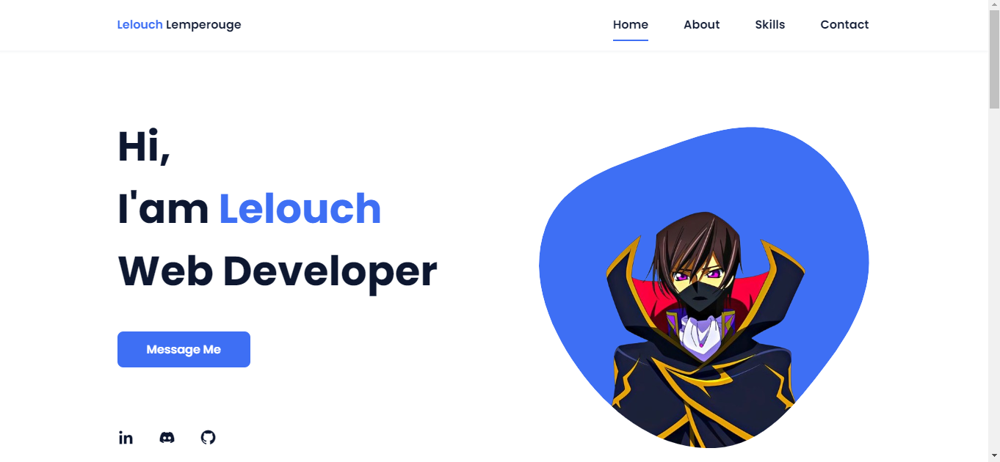

# Lelouch Lamperouge Portfolio Website

A personal portfolio website for Lelouch Lamperouge built using HTML, CSS, and JavaScript.

## Features

- **Animations on Scroll**: Smooth animations that trigger when scrolling through different sections.
- **Mobile-First Design**: Initially designed for mobile devices, ensuring a responsive and fluid experience on all screens.
- **Smooth Scrolling**: Seamless scrolling behavior between sections for improved user experience.
- **Cross-Device Compatibility**: Works beautifully across all mobile devices and desktops.

## Preview

## Technologies Used

- HTML
- CSS
- JavaScript

## Server Live 

Check out the [Server Live](https://razeltamtia21.github.io/Website-Lelouch-Lamperouge/) to see the responsive website in action across different devices.
